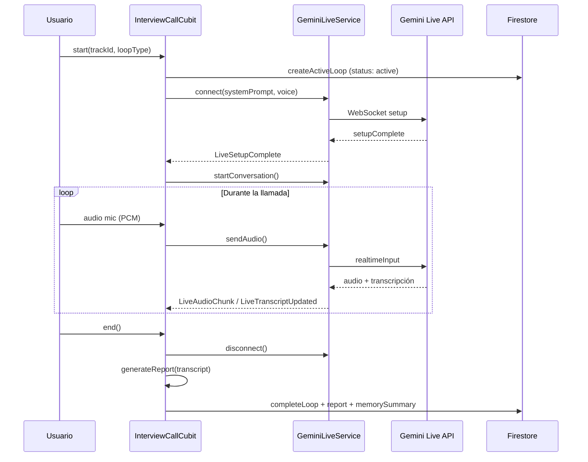

# Modelo de IA para las entrevistas (loops)

Este documento describe cómo Loop conecta con Gemini para las sesiones de voz en tiempo real.

## Resumen

| Aspecto | Detalle |
|---------|---------|
| **Proveedor** | Google Gemini API (directo desde el cliente) |
| **Modo en vivo** | `gemini-3.1-flash-live-preview` vía WebSocket |
| **Transporte** | `BidiGenerateContent` (audio bidireccional) |
| **Análisis post-loop** | REST `generateContent` con modelos Flash (ver [loop-analysis-and-memory.md](./loop-analysis-and-memory.md)) |
| **API key** | `GEMINI_API_KEY` en `env.json` (empaquetado como asset o `--dart-define`) |

No hay Firebase Functions ni proxy intermedio: la app abre el WebSocket y envía el audio PCM directamente a Google.

---

## Arquitectura de una llamada

```
Usuario (mic) ──► InterviewAudioService (16 kHz PCM)
                        │
                        ▼ (solo si el reclutador no habla)
                  GeminiLiveService ──► WebSocket Gemini Live
                        │
                        ▼ (audio 24 kHz PCM)
                  InterviewAudioService (reproducción)
                        │
                        ▼
                  Transcripción en tiempo real (UI)
```

Archivos principales:

- `lib/features/interview_call/data/services/gemini_live_service.dart`
- `lib/features/interview_call/data/services/gemini_config.dart`
- `lib/features/interview_call/data/services/interview_prompt.dart`
- `lib/features/interview_call/data/services/audio_service.dart`
- `lib/features/interview_call/presentation/cubit/interview_call_cubit.dart`

---

## Conexión Live (WebSocket)

### Endpoint

```
wss://generativelanguage.googleapis.com/ws/
  google.ai.generativelanguage.v1beta.GenerativeService.BidiGenerateContent?key=...
```

### Mensaje `setup`

Al conectar, se envía la configuración del modelo:

```json
{
  "setup": {
    "model": "models/gemini-3.1-flash-live-preview",
    "generationConfig": {
      "responseModalities": ["AUDIO"],
      "speechConfig": {
        "voiceConfig": {
          "prebuiltVoiceConfig": { "voiceName": "Sadaltager" }
        }
      }
    },
    "systemInstruction": { "parts": [{ "text": "<system prompt>" }] },
    "inputAudioTranscription": {},
    "outputAudioTranscription": {},
    "realtimeInputConfig": {
      "automaticActivityDetection": {
        "startOfSpeechSensitivity": "START_SENSITIVITY_LOW",
        "endOfSpeechSensitivity": "END_SENSITIVITY_LOW",
        "prefixPaddingMs": 100,
        "silenceDurationMs": 800
      }
    }
  }
}
```

### Voces del reclutador

Configurables en perfil → Preferencias (`RecruiterVoice`):

| Voz en app | Nombre API |
|------------|------------|
| Profesional (Sadaltager) | `Sadaltager` |
| Cálido (Puck) | `Puck` |
| Claro (Kore) | `Kore` |
| Directo (Fenrir) | `Fenrir` |

---

## Audio

### Entrada (micrófono del candidato)

- Formato: **PCM 16-bit, mono, 16 kHz**
- Paquete: `realtimeInput.audio` en base64
- MIME: `audio/pcm;rate=16000`
- Permisos: micrófono requerido antes de iniciar
- Echo cancel y noise suppress activados (`record` package)

### Salida (voz del reclutador)

- Chunks PCM recibidos en `serverContent.modelTurn.parts[].inlineData`
- Reproducción a **24 kHz** vía `flutter_pcm_sound`

### Half-duplex

El micrófono **no envía audio mientras el modelo está hablando** (`!_audio.isPlaying`). Evita que el candidato interrumpa el stream del reclutador y reduce eco.

---

## Tipos de loop (prompts)

Cada sesión usa un **system prompt** distinto según el tipo de loop.

### 1. Prep (`loopType=prep`)

Primer loop de un trayecto. El modelo actúa como **coach**, no como entrevistador completo.

- Explica el rol, qué evalúan, 2 consejos y 1 pregunta de práctica
- Mensaje inicial: *"Hola, quiero prepararme para este puesto."*
- **No genera reporte** al terminar; solo guarda transcripción en Firestore
- Marca `prepCompleted: true` en el trayecto

### 2. Entrevista (`loopType=interview`)

Loop de práctica real. El modelo actúa como **reclutador**.

- Saluda, confirma el rol, hace **3 preguntas una a la vez**
- Espera respuesta del candidato entre preguntas
- Cierra con feedback breve
- Al terminar → genera **reporte JSON** (análisis)

El system prompt se compone en capas (`buildInterviewSystemPrompt`):

1. Prompt base del reclutador (ES/EN según idioma de la app)
2. Perfil del candidato (nombre, objetivo, experiencia)
3. Contexto del trayecto (puesto, empresa, descripción, número de ciclo)
4. **Memoria** del loop anterior (si `sourceLoopId` está presente)

### Idioma

El idioma de la app (`SettingsCubit.language`) sincroniza:

- System prompt (ES/EN)
- Mensaje de inicio de conversación
- Voz y transcripciones
- Reporte post-loop

---

## Flujo de eventos Live

| Evento | Qué hace la app |
|--------|-----------------|
| `setupComplete` | Inicia mic, player, timer y primer turno de texto |
| `LiveAudioChunk` | Encola y reproduce audio del reclutador |
| `LiveInterrupted` | Limpia cola de reproducción (barge-in del usuario) |
| `LiveTranscriptUpdated` | Actualiza lista de turnos en pantalla |
| `LiveTurnComplete` | Fin de turno del modelo (sin acción extra) |
| `LiveClosed` | Error o cierre → fase `error` |

### Transcripción

Los fragmentos de `inputTranscription` y `outputTranscription` se concatenan por hablante consecutivo en `TranscriptTurn`:

- `candidate` → candidato
- `interviewer` → reclutador (IA)

---

## Timer y reglas de finalización

| Constante | Valor | Efecto |
|-----------|-------|--------|
| `kLoopDurationSeconds` | 300 (5 min) | Cuenta regresiva; al llegar a 0 llama `end()` automáticamente |
| `kMinReportSeconds` | 10 | Si la sesión dura menos → `abandonLoop`, sin reporte |

### Al colgar (`end()`)

1. Detiene WebSocket, mic y reproducción
2. Si transcripción vacía o &lt; 10 s → abandona el loop
3. Si es **prep** → `completePrepLoop` + `markPrepCompleted`
4. Si es **entrevista** → `InterviewReportService.generateReport()` → `completeLoop` + `incrementCycle`

También se llama a `end()` (con reporte si aplica) cuando:

- el temporizador llega a 0
- el reclutador/coach cierra la sesión (frase explícita o despedida)
- la conexión Live se cierra inesperadamente durante la llamada

---

## Seguridad y límites actuales

- La API key vive en el cliente (`env.json`). Adecuado para desarrollo; en producción conviene proxy/backend.
- No hay grabación local del audio; solo transcripción textual persistida.
- La memoria entre loops se inyecta en el **system prompt** del siguiente loop, no en el contexto del WebSocket Live de forma automática por Google.

---

## Diagrama de secuencia (entrevista)


