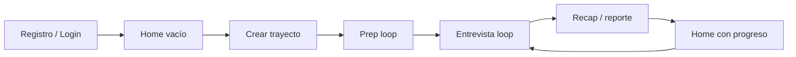

# Funcionamiento de la app Loop

Loop es una app Flutter para practicar entrevistas por voz, medir progreso y organizar prácticas por puesto objetivo.

---

## Stack técnico

| Capa | Tecnología |
|------|------------|
| UI | Flutter, Material 3, tema claro/oscuro |
| Estado | `flutter_bloc` (Cubits) |
| Navegación | `go_router` |
| Auth / datos | Firebase Auth + Cloud Firestore (`databaseId: default`) |
| Voz en vivo | Gemini Live API (WebSocket directo) |
| Análisis | Gemini REST (`generateContent`) |
| Preferencias locales | `shared_preferences` (idioma, tema) |
| Conectividad | `connectivity_plus` (gate Wi‑Fi al inicio) |
| Secrets | `env.json` → `GEMINI_API_KEY` (asset + opcional `--dart-define`) |

---

## Arranque de la app

```
main()
  ├── AppEnv.load()          # GEMINI_API_KEY desde asset o dart-define
  ├── SettingsStorage.load() # idioma + tema desde SharedPreferences
  └── LoopBootstrap
        ├── ¿Hay Wi‑Fi? ──No──► NoConnectionScreen (reconectar, cambiar idioma)
        └── Sí ──► Firebase.initializeApp()
                   └── LoopApp (repositorios, cubits, GoRouter)
```

Sin Wi‑Fi la app **no carga** el resto (Firebase, navegación principal). La pantalla offline respeta idioma guardado y permite cambiarlo.

---

## Arquitectura por features

Cada feature bajo `lib/features/<nombre>/`:

```
domain/entities/      # Modelos de datos
domain/repositories/  # Interfaces
domain/usecases/      # Casos de uso (un método)
data/repositories/    # Implementaciones (Firestore o Mock)
presentation/cubit/   # Cubit + State
presentation/         # Pantallas y widgets
```

`lib/core/` — transversal:

- `navigation/` — `AppRouter`, `AppShell`, rutas
- `settings/` — idioma, tema, voz reclutador; persistencia local
- `localization/app_strings.dart` — todos los textos (ES/EN manual, no ARB)
- `theme/` — `LoopTheme`, `LoopColors`
- `widgets/` — `LoopCard`, `LevelCircle`, skeletons, etc.
- `bootstrap/`, `connectivity/`, `config/`

Registro de dependencias en `lib/main.dart`: `MultiRepositoryProvider` + `MultiBlocProvider`.

---

## Navegación

### Shell inferior (4 pestañas + FAB)

| Ícono | Ruta | Pantalla |
|-------|------|----------|
| Home | `/` | Dashboard, nivel, racha, última práctica |
| Trayectorias | `/loops` | Lista de puestos / prácticas |
| CV | `/cv` | Placeholder (próximamente) |
| Roadmap | `/roadmap` | Placeholder (próximamente) |
| FAB (loop) | `/loops/create` | Crear trayecto |

### Fuera del shell

| Ruta | Pantalla |
|------|----------|
| `/welcome`, `/login`, `/register`, `/forgot-password` | Onboarding / auth |
| `/loops/create` | Crear trayecto (sin shell) |
| `/profile` | Perfil y preferencias |
| `/interview` | Llamada / loop en vivo |
| `/recap` | Reporte post-entrevista |

---

## Conceptos de producto

### Trayectoria (track)

Un **puesto objetivo**: rol, empresa, descripción de la oferta.

- Se crea eligiendo una plantilla sugerida (según `goal`), pegando una oferta o generando con IA
- Vive en `users/{uid}/tracks/{trackId}`

### Loop

Una **sesión de práctica** de voz bajo un trayecto:

- `users/{uid}/tracks/{trackId}/loops/{loopId}`
- Tipos: **prep** (primera vez) e **interview** (entrevista con reporte)
- Duración máxima: 5 minutos
- Mínimo 10 s para contar como válido

### Ciclo

Cada entrevista completada incrementa `cyclesCompleted` en el trayecto. El prep no cuenta como ciclo de entrevista pero desbloquea las entrevistas siguientes.

---

## Flujo principal del usuario



1. **Home sin trayectos** — CTA “Crea tu primer loop”, stats en 0, nivel “Sin medir aún”
2. **Crear trayecto** — pestañas Sugeridos (plantillas por `goal`) / Pegar oferta / IA → prep automático
3. **Prep** — coach de voz → al terminar, entrevista siguiente
4. **Entrevista** — reclutador IA → reporte → recap
5. **Home con datos** — última práctica, racha, loops totales, nivel si hay medición

---

## Home dashboard

Fuente: `FirestoreHomeDashboardRepository`

- **Racha**: días consecutivos con al menos un loop `completed` (ver `streak_calculator.dart`)
- **Loops**: conteo de loops completados en todos los trayectos
- **Rutas**: número de trayectos
- **Nivel general**: `latestLevel` del trayecto con ciclos; vacío si nunca midió
- **Última práctica**: solo el trayecto más reciente (lista completa en `/loops`)

Estados de carga: **skeletons** (sin spinners).

---

## Perfil y preferencias

En `/profile` (ExpansionTile):

| Preferencia | Persistencia |
|-------------|--------------|
| Tema claro/oscuro | `SharedPreferences` |
| Idioma ES/EN | `SharedPreferences` |
| Voz del reclutador | Solo en memoria (sesión) |

El idioma afecta: UI, prompts Live, reportes y mensajes del reclutador.

---

## Pantalla de entrevista

Controles:

- **Micrófono** — silenciar candidato
- **Colgar** — finaliza loop

No hay pausa. Timer regresivo visible. Transcripción en tiempo real.

Query params de `/interview`:

- `trackId` — obligatorio
- `loopType` — `prep` | `interview`
- `sourceLoopId` — opcional, para memoria del loop anterior

---

## Firebase

### Auth

Email/contraseña. Rutas protegidas redirigen a `/welcome` si no hay sesión verificada.

### Firestore

Base de datos: **`default`** (no la `(default)` automática legacy).

Colecciones por usuario:

- `tracks` + subcolección `loops`
- Perfil y otros datos en documento `users/{uid}`

Reglas: `firestore.rules` — usuario solo accede a sus propios datos.

---

## Configuración de desarrollo

```bash
cp env.example.json env.json   # añadir GEMINI_API_KEY
flutter pub get
flutter run                    # lee env.json como asset
flutter analyze
flutter test
```

Opcional: `./scripts/run_dev.sh` (equivale a `flutter run --dart-define-from-file=env.json`).

Deploy reglas:

```bash
firebase deploy --only firestore:rules --project the-loop-d46af
```

---

## Features en mock / placeholder

| Feature | Estado |
|---------|--------|
| `cv_analysis` | UI placeholder |
| `roadmap` | UI placeholder |
| Auth, profile, loops, interview, recap, home | Firestore real |

---

## Documentación relacionada

- [Modelo de IA para entrevistas](./ai-interview-model.md)
- [Análisis y memoria de loops](./loop-analysis-and-memory.md)
