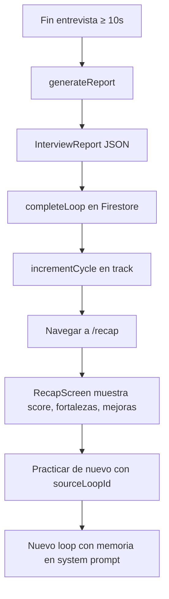

# Análisis, reporte y memoria de cada loop

Este documento explica qué ocurre **después** de una entrevista (no prep): cómo se analiza la conversación, qué se guarda y cómo se reutiliza en el siguiente loop.

---

## Cuándo hay análisis

| Tipo de loop | ¿Genera reporte? | ¿Guarda memoria? |
|--------------|------------------|------------------|
| **Prep** | No | Solo transcripción |
| **Entrevista** | Sí | Sí (`memorySummary` + campos del reporte) |
| **Abandonado** (&lt; 10 s o sin transcripción) | No | No |

Servicio: `lib/features/interview_call/data/services/interview_report_service.dart`

---

## Generación del reporte

### Modelos usados (REST, no Live)

Se intentan en orden con reintentos ante 429/503:

1. `gemini-flash-latest`
2. `gemini-flash-lite-latest`
3. `gemini-2.0-flash`

Endpoint:

```
POST https://generativelanguage.googleapis.com/v1beta/models/{model}:generateContent?key=...
```

`generationConfig.responseMimeType: application/json` fuerza respuesta estructurada.

### Entrada

La transcripción completa del loop, con prefijos:

```
Candidato: ...
Reclutador: ...
```

Más instrucciones de idioma (ES/EN) y reglas de brevedad.

### Esquema JSON esperado

```json
{
  "role": "string",
  "summary": "string",
  "strengths": ["string"],
  "improvements": ["string"],
  "score": 7.5,
  "recommendation": "string",
  "memorySummary": "string"
}
```

| Campo | Uso en la app |
|-------|----------------|
| `role` | Título en recap |
| `summary` | Resumen en recap y home |
| `strengths` | Tarjeta “Fortaleza” |
| `improvements` | Tarjeta “Mejora” |
| `score` | Nivel 1–10 → `level = score / 2` en recap; `latestScore` en trayecto |
| `recommendation` | Texto de seguimiento |
| `memorySummary` | **Memoria** para el próximo loop |

### Límites de brevedad (prompt)

- `summary`: máx. 2 frases
- `strengths` / `improvements`: máx. 2 ítems, 10 palabras c/u
- `recommendation`: 1 frase
- `memorySummary`: 1 frase para repetir la práctica

El parser trunca además en código (`_shortText`) por si el modelo se excede.

---

## Persistencia en Firestore

### Estructura

```
users/{uid}/
  tracks/{trackId}/
    title, company, jobDescription
    prepCompleted, cyclesCompleted
    latestScore, latestLevel
    createdAt, updatedAt

    loops/{loopId}/
      status: active | completed | abandoned
      loopType: prep | interview
      sourceLoopId?: string
      profileSnapshot: { name, goal, customGoal, experience }
      startedAt, endedAt, updatedAt
      durationSeconds
      transcript: [{ speaker, text }, ...]
      report?: { role, summary, strengths, improvements, score, recommendation }
      memorySummary?: string
```

Los loops viven **bajo cada trayecto**, no en una colección plana.

### Completar entrevista (`completeLoop`)

En un batch:

1. Actualiza el documento del loop con `status: completed`, `transcript`, `report`, `memorySummary`
2. Actualiza el trayecto con `latestScore` y `latestLevel` (= `score / 2`)
3. Incrementa `cyclesCompleted` en el trayecto

### Completar prep (`completePrepLoop`)

- Guarda transcripción y duración
- No escribe `report` ni `memorySummary`
- Pone `prepCompleted: true` en el trayecto

---

## Sistema de memoria

La “memoria” **no** es un vector store ni RAG externo. Es **contexto textual** inyectado en el system prompt del **siguiente** loop de entrevista.

### Origen

Al practicar de nuevo desde recap (`/interview?trackId=...&sourceLoopId=...`), el cubit carga el loop anterior:

```dart
previousLoop = await _loops.getLoop(trackId: trackId, loopId: sourceLoopId);
```

### Inyección en el prompt (`buildInterviewSystemPrompt`)

Si `previousLoop.report` existe, se añade al system prompt (ES ejemplo):

```
Esta práctica repite una entrevista anterior.
Memoria previa: {memorySummary}
Fortalezas previas: {strengths.join('; ')}
Áreas a mejorar: {improvements.join('; ')}
Comprueba si el candidato mejoró, sin revelar esta memoria literalmente.
```

El reclutador Live **no ve** el historial de chat anterior en el WebSocket; solo recibe estas instrucciones en `systemInstruction` al conectar.

### Qué implica

- La memoria es **por loop fuente** (`sourceLoopId`), típicamente el último completado
- Solo aplica a loops tipo **interview**, no a prep
- El candidato no ve la memoria en UI; solo el feedback del recap del loop actual
- Si el usuario inicia un loop nuevo sin `sourceLoopId`, la app **resuelve automáticamente** el último loop de entrevista completado del trayecto

---

## Flujo completo: de la llamada al recap



---

## Métricas derivadas en la app

| Dato | Origen |
|------|--------|
| Nivel general (home) | `latestLevel` del trayecto más reciente con ciclos |
| Racha | Días consecutivos con loops `completed` (cualquier tipo) |
| Total loops (home) | Conteo de loops completados en todos los trayectos |
| Delta en recap | Por ahora `0` (placeholder) |
| Progreso del trayecto | `cyclesCompleted / 5` en UI de trayectorias |

---

## Reglas de Firestore relevantes

- Solo el dueño (`auth.uid == userId`) lee/escribe sus datos
- Crear loop: `status` debe ser `active`
- Completar entrevista: exige `report` (map), `memorySummary` (string), `transcript`, `durationSeconds`
- Completar prep: exige `loopType == 'prep'`, sin reporte
- Abandonar: solo cambia `status`, `endedAt`, `updatedAt`
- No se permiten deletes en tracks ni loops

Ver `firestore.rules` en la raíz del proyecto.

---

## IA auxiliar en trayectos

Al **crear un trayecto con IA** (`FirestoreTracksRepository.generateFromDescription`), se usa otro llamado REST a `gemini-flash-latest` para extraer `title`, `company`, `jobDescription` desde texto libre del usuario. Eso es independiente del análisis post-loop.
